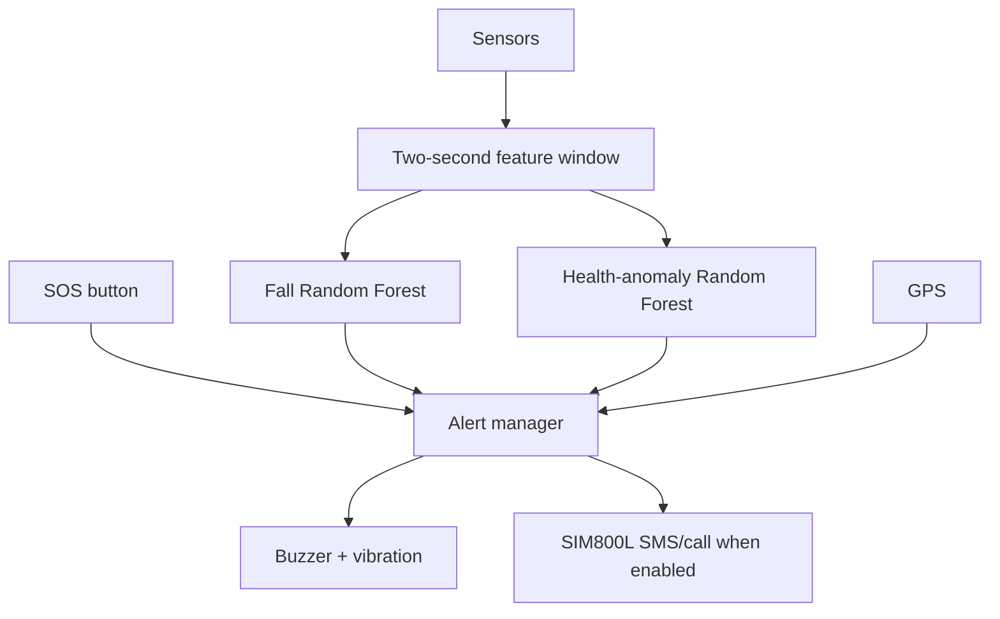

# ALERTA_Prototype

**AI-assisted multi-domain safety wearable prototype** for people living with
Alzheimer's disease, older adults, and people who may need rapid emergency
assistance.

This repository is a clean, reproducible rebuild for:

- ESP32
- SIM800L GSM
- MPU6050 accelerometer/gyroscope
- MAX30102 or MAX30105 pulse-oximeter module
- NEO-6M GPS
- INMP441 I2S microphone
- SOS button, active buzzer, and transistor-driven vibration motor
- Two Random Forest classifiers: **fall detection** and **health anomaly
  screening**

> **Important:** ALERTA is an educational research prototype. It is not a
> certified medical device and must not be used as the only emergency or
> medical monitoring system. The included dataset is synthetic and its model
> scores do not demonstrate clinical performance.

## What is included

```text
ALERTA_Rebuild/
├── include/                 Pin configuration, shared types, generated ML header
├── src/                     Integrated non-blocking ESP32 firmware
├── firmware_tests/          One small sketch for each hardware subsystem
├── ml/                      Synthetic-data, training, evaluation and C++ export
├── data/                    Reproducible synthetic feature dataset
├── artifacts/               Trained models, metrics and plots
├── docs/                    Wiring, testing, safety and model documentation
└── platformio.ini           Reproducible VS Code + PlatformIO environment
```

## Recommended order

1. Read [`docs/SAFETY.md`](docs/SAFETY.md), especially the SIM800L and motor
   power notes.
2. Wire and run each sketch in `firmware_tests/` separately.
3. Edit the emergency number and feature flags in `include/config.h`.
4. Generate the data and train the models.
5. Build and upload the integrated firmware only after all individual tests
   pass.

## 1. Firmware setup

Install [VS Code](https://code.visualstudio.com/) and the PlatformIO extension,
then open this repository folder. PlatformIO installs the declared libraries
from `platformio.ini`.

Edit these values before any real GSM test:

```cpp
// include/config.h
inline constexpr bool ENABLE_GSM_ALERTS = false;
inline constexpr char EMERGENCY_NUMBER[] = "+8801XXXXXXXXX";
```

Keep `ENABLE_GSM_ALERTS` set to `false` during bench testing. Build from the
PlatformIO toolbar or run:

```bash
pio run
```

Upload only after checking the correct serial port:

```bash
pio run --target upload
pio device monitor
```

The serial monitor prints a CSV stream containing sensor values, window
features, model probabilities, GPS information and alert state.

## 2. ML setup

From the repository root:

```bash
python3 -m venv .venv
source .venv/bin/activate
python -m pip install -r ml/requirements.txt
```

Generate a deterministic synthetic dataset:

```bash
python ml/generate_synthetic_data.py \
  --rows 6000 --subjects 80 --seed 42 \
  --output data/alerta_synthetic_v1.csv
```

Train, evaluate and export both Random Forests:

```bash
python ml/train_models.py \
  --data data/alerta_synthetic_v1.csv \
  --outdir artifacts \
  --header include/generated_models.h \
  --seed 42
```

The training script uses a subject-grouped split, reports accuracy, balanced
accuracy, precision, recall, F1 and ROC-AUC, saves confusion matrices, and
exports the fitted forests to ordinary C++ for ESP32 inference.

Run the validation suite:

```bash
python -m unittest discover -s ml/tests -v
```

On macOS/Linux, `make all` reproduces the dataset, models and validation in one
command after the Python requirements are installed.

To record ethically collected, labelled serial windows later, see
`ml/capture_serial.py` and `docs/SAFETY.md`.

## 3. How the integrated prototype works



- SOS is immediate after a configurable long press.
- A fall alert requires a high model probability in a completed motion
  window.
- A health alert requires persistence across multiple windows to reduce false
  alarms.
- The microphone currently supplies a sound-level feature and hardware test;
  scream classification is intentionally left for a later, real-audio phase.
- Rule-based fall detection remains as a fallback if the generated model is
  disabled.

## 4. Collecting real data later

The synthetic CSV is for software integration only. Before reporting real
performance:

- obtain informed consent and appropriate ethics approval;
- collect labelled activities of daily living and safely simulated falls;
- record device placement, subject, sampling rate and missingness;
- keep subjects separated between training and test sets;
- evaluate false alarms, sensitivity and time-to-alert;
- validate heart-rate and SpO2 against an appropriate reference device.

## Portfolio-safe description

> Developed a modular ESP32-based safety-wearable prototype integrating motion,
> pulse-oximetry, GPS, GSM and audio sensing. Built a reproducible Python
> pipeline for synthetic feature generation and subject-grouped Random Forest
> baselines for fall and health-anomaly screening, with exported on-device C++
> inference. The current results are simulation-based and await validation on
> ethically collected real-world data.

## License

MIT License. See [`LICENSE`](LICENSE).

For a deletion-resistant Git/GitHub workflow, follow
[`docs/GITHUB_SETUP.md`](docs/GITHUB_SETUP.md).
